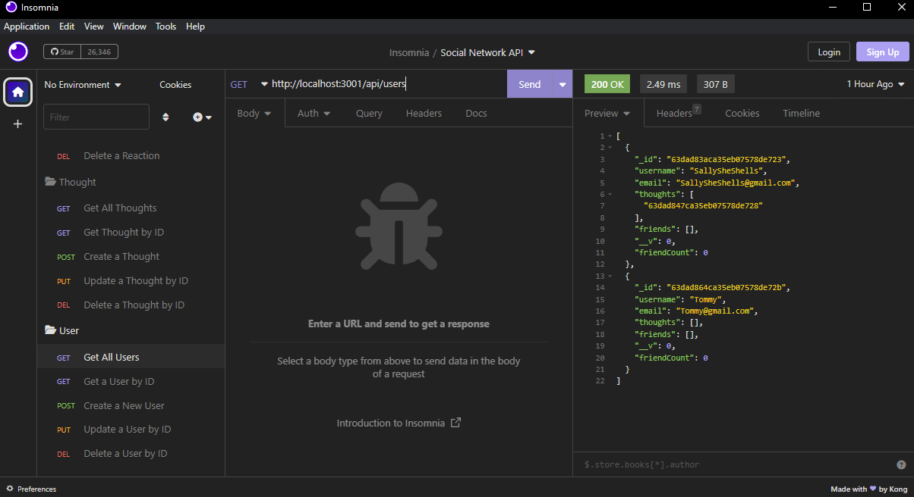
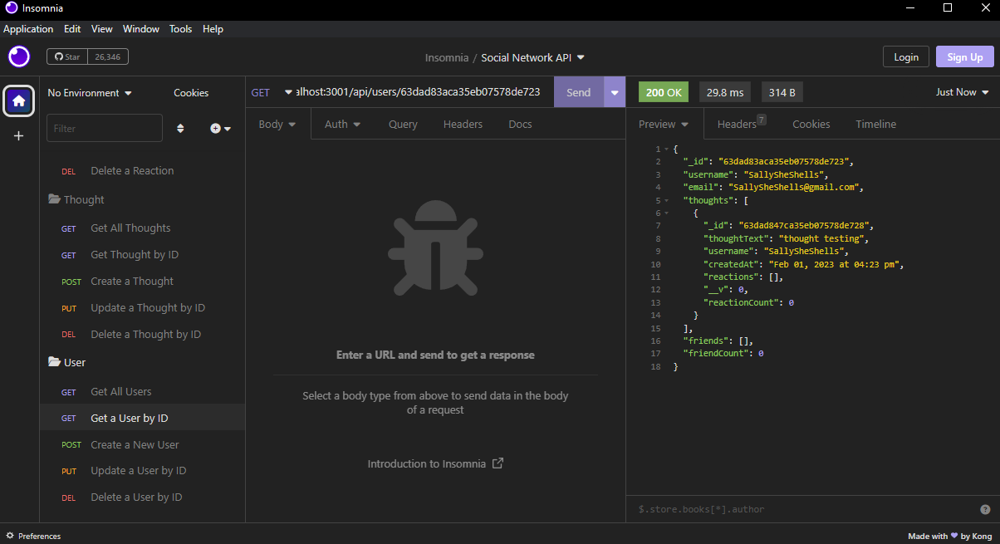
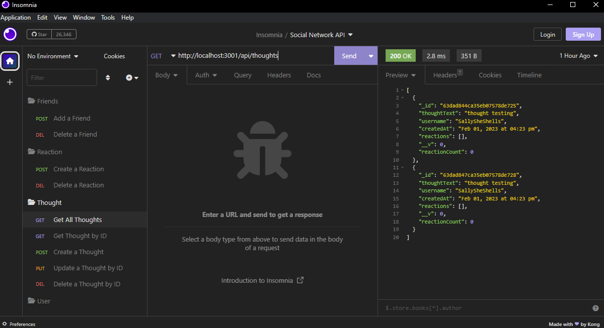
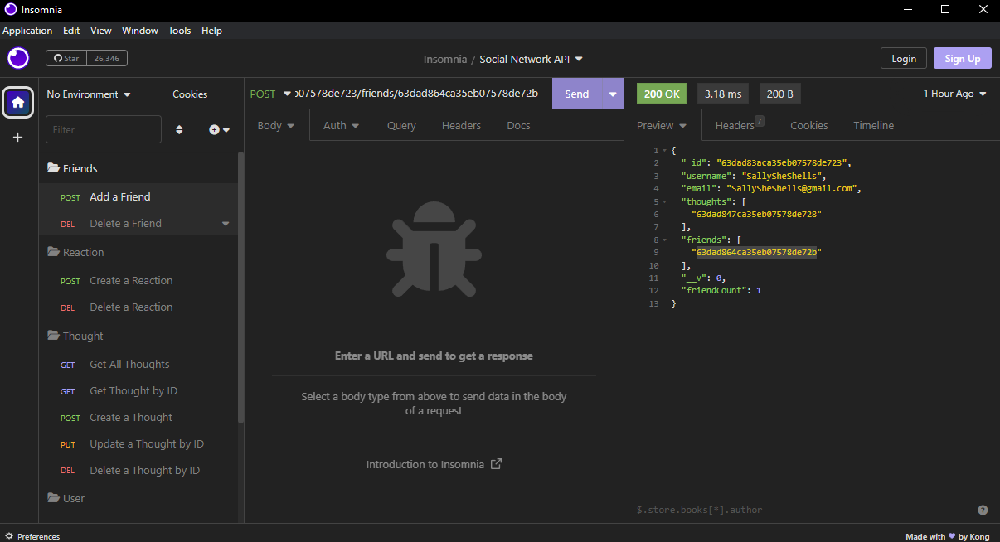
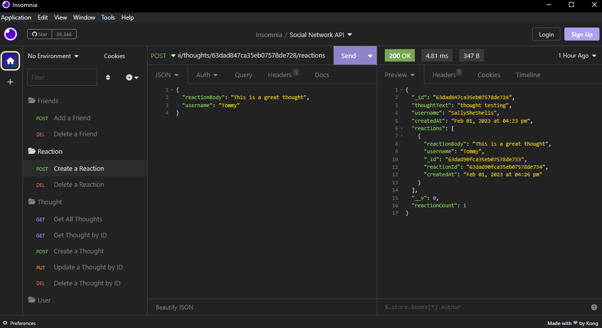

# Social-Network-API-NoSQL

[Link to my profile](https://github.com/cujion)

## Table of Contents
- [Description](#description)
- [Visuals](#visuals)
- [Tests](#tests)
- [License](#license)

## Description
* This is a NoSQL Social Network BackEnd API using MongoDB and Mongoose. In this application you learn how to setup models using MongoDB in order to structure your data. Once you have your data models setup you can begin setting up your routes and controllers in order to display the correct data using insomnia. All of your controllers are then setup in a module.exports where they then get pulled into your routes and then define how your routing for each function is going to be called from. 

## Visuals

https://drive.google.com/file/d/1xyrngwR2vxc--wPyCNA_mjOPYXNR2qVW/view

## License
* MIT License

* Copyright (c) [2022]] [Christopher Bonime]

* Permission is hereby granted, free of charge, to any person obtaining a copy
of this software and associated documentation files (the "Software"), to deal
in the Software without restriction, including without limitation the rights
to use, copy, modify, merge, publish, distribute, sublicense, and/or sell
copies of the Software, and to permit persons to whom the Software is
furnished to do so, subject to the following conditions:

* The above copyright notice and this permission notice shall be included in all
copies or substantial portions of the Software.

* THE SOFTWARE IS PROVIDED "AS IS", WITHOUT WARRANTY OF ANY KIND, EXPRESS OR
IMPLIED, INCLUDING BUT NOT LIMITED TO THE WARRANTIES OF MERCHANTABILITY,
FITNESS FOR A PARTICULAR PURPOSE AND NONINFRINGEMENT. IN NO EVENT SHALL THE
AUTHORS OR COPYRIGHT HOLDERS BE LIABLE FOR ANY CLAIM, DAMAGES OR OTHER
LIABILITY, WHETHER IN AN ACTION OF CONTRACT, TORT OR OTHERWISE, ARISING FROM,
OUT OF OR IN CONNECTION WITH THE SOFTWARE OR THE USE OR OTHER DEALINGS IN THE
SOFTWARE.